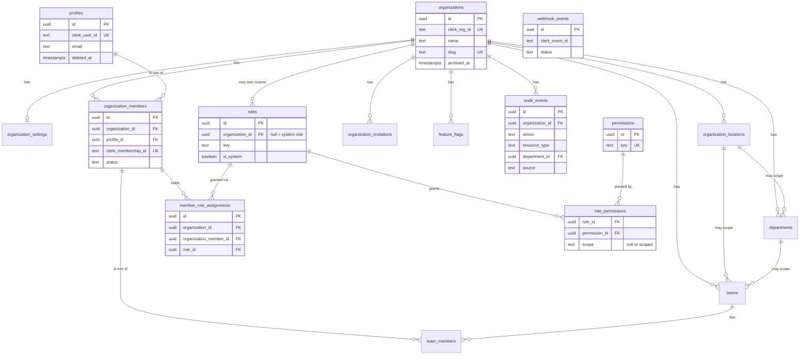

# Database Schema

Implements Phase 4 (Database and tenant isolation) of the
[phase tracker](../project/phase-tracker.md): the
[domain model](domain-model.md)'s Organization/Member/Role/Location/
Department/Team slice, plus the Clerk identity-mapping and audit tables
Phase 3 deferred. Source of truth for the actual schema is the committed
migrations in [supabase/migrations/](../../supabase/migrations/) — this
document explains and cross-references them, and is updated in the same
change whenever they change, per [CLAUDE.md](../../CLAUDE.md).

## Entity relationship diagram

## Tables

| Table                           | Migration                                                  |    Tenant-owned?    | Notes                                                                                                                                                                                                                                                  |
| ------------------------------- | ---------------------------------------------------------- | :-----------------: | ------------------------------------------------------------------------------------------------------------------------------------------------------------------------------------------------------------------------------------------------------ |
| `profiles`                      | `20260719130001_extensions_helpers_profiles_organizations` |         No          | One row per Clerk user, spans organizations via `organization_members`.                                                                                                                                                                                |
| `organizations`                 | `20260719130001_...`                                       | — (the tenant root) | `id` is the internal identity; `clerk_org_id` is the Clerk one.                                                                                                                                                                                        |
| `organization_settings`         | `20260719130001_...`                                       |         Yes         | 1:1 with `organizations`, extensible `settings jsonb`.                                                                                                                                                                                                 |
| `organization_members`          | `20260719130002_membership_roles_permissions`              |         Yes         | `status`: `active`/`suspended`/`removed`. Removed rows are never deleted (see [data-ownership.md](data-ownership.md)).                                                                                                                                 |
| `roles`                         | `20260719130002_...`                                       |      Nullable       | `organization_id is null` = one of the 7 system roles ([product/user-roles.md](../../product/user-roles.md)); non-null is reserved for custom roles (Phase 21).                                                                                        |
| `permissions`                   | `20260719130002_...`                                       |         No          | Global catalog, seeded from [product/permissions-matrix.md](../../product/permissions-matrix.md).                                                                                                                                                      |
| `role_permissions`              | `20260719130002_...`                                       |     Via `roles`     | `scope = 'scoped'` marks a "Scoped" (not organization-wide) grant.                                                                                                                                                                                     |
| `member_role_assignments`       | `20260719130002_...`                                       |         Yes         | Which member holds which role. Insert enforces no-self-escalation at the RLS layer (see below).                                                                                                                                                        |
| `organization_locations`        | `20260719130003_locations_departments_teams`               |         Yes         |                                                                                                                                                                                                                                                        |
| `departments`                   | `20260719130003_...`                                       |         Yes         | Optionally scoped to a location.                                                                                                                                                                                                                       |
| `teams`                         | `20260719130003_...`                                       |         Yes         | Optionally scoped to a department and/or location.                                                                                                                                                                                                     |
| `team_members`                  | `20260719130003_...`                                       |         Yes         |                                                                                                                                                                                                                                                        |
| `organization_invitations`      | `20260719130004_invitations_feature_flags`                 |         Yes         |                                                                                                                                                                                                                                                        |
| `feature_flags`                 | `20260719130004_...`                                       |         Yes         | Per-organization overrides; build-wide flags stay env-var-driven.                                                                                                                                                                                      |
| `audit_events`                  | `20260719130005_audit_webhook_idempotency`                 |         Yes         | Append-only — no update/delete grant to any non-admin role. `department_id` added in `20260730000001_audit_scoped_views` so a scoped `audit.view`/`audit.export` grant resolves to real rows — see [audit-and-compliance.md](audit-and-compliance.md). |
| `webhook_events`                | `20260719130005_...`                                       |      Nullable       | Clerk webhook processing log; the actual idempotency guard for `/api/webhooks/clerk`.                                                                                                                                                                  |
| `idempotency_keys`              | `20260719130005_...`                                       |      Nullable       | General-purpose idempotent-operation guard (e.g. Phase 8 task completion), separate from `webhook_events`.                                                                                                                                             |
| `exceptions`                    | `20260727000001_exceptions_capa`                           |         Yes         | Phase 11. The recorded deviation itself — see [exception-management.md](exception-management.md).                                                                                                                                                      |
| `exception_comments`            | `20260727000001_...`                                       |         Yes         | Discussion thread on an exception.                                                                                                                                                                                                                     |
| `exception_links`               | `20260727000001_...`                                       |         Yes         | Polymorphic link (`linked_type`/`linked_id`, no FK — validated at the service layer) to another record.                                                                                                                                                |
| `exception_history`             | `20260727000001_...`                                       |         Yes         | Append-only lifecycle log, same shape as `task_history`/`workflow_history`.                                                                                                                                                                            |
| `exception_containment_actions` | `20260727000001_...`                                       |         Yes         |                                                                                                                                                                                                                                                        |
| `root_cause_analyses`           | `20260727000001_...`                                       |         Yes         | One per exception (`unique (exception_id)`).                                                                                                                                                                                                           |
| `root_cause_factors`            | `20260727000001_...`                                       |         Yes         | Ordered Five-Whys steps / contributing factors under an analysis.                                                                                                                                                                                      |
| `capa_plans`                    | `20260727000001_...`                                       |         Yes         | A corrective/preventive action plan against an exception.                                                                                                                                                                                              |
| `capa_actions`                  | `20260727000001_...`                                       |         Yes         | Individual corrective/preventive action items under a plan.                                                                                                                                                                                            |
| `capa_approvals`                | `20260727000001_...`                                       |         Yes         |                                                                                                                                                                                                                                                        |
| `capa_effectiveness_checks`     | `20260727000001_...`                                       |         Yes         |                                                                                                                                                                                                                                                        |
| `temporary_waivers`             | `20260727000001_...`                                       |         Yes         | `expires_at` is required, never optional — a waiver cannot silently become permanent.                                                                                                                                                                  |
| `waiver_approvals`              | `20260727000001_...`                                       |         Yes         |                                                                                                                                                                                                                                                        |
| `waiver_renewals`               | `20260727000001_...`                                       |         Yes         |                                                                                                                                                                                                                                                        |
| `recurrence_matches`            | `20260727000001_...`                                       |         Yes         | Logged heuristic matches, not a duplicate-detection guarantee.                                                                                                                                                                                         |
| `training_courses`              | `20260728000001_training_certifications`                   |         Yes         | Phase 12. See [training-and-certifications.md](training-and-certifications.md).                                                                                                                                                                        |
| `training_course_versions`      | `20260728000001_...`                                       |         Yes         | Immutable once published, same pattern as `form_versions`.                                                                                                                                                                                             |
| `training_assignments`          | `20260728000001_...`                                       |         Yes         | One row per `(course_version, assignee)`.                                                                                                                                                                                                              |
| `training_assignment_history`   | `20260728000001_...`                                       |         Yes         | Append-only, same shape as `task_history`.                                                                                                                                                                                                             |
| `certifications`                | `20260728000001_...`                                       |         Yes         | `expires_at` nullable only as an explicit non-expiring choice; renewal inserts a new row chained via `renewed_from_certification_id`.                                                                                                                  |
| `ai_drafts`                     | `20260729000001_ai_copilot`                                |         Yes         | Phase 13. See [ai-architecture.md](ai-architecture.md). No mutation function is ever called from an `ai_drafts` write path.                                                                                                                            |
| `ai_usage_events`               | `20260729000001_...`                                       |         Yes         | One row per adapter call — token/model/feature — independent of whether a draft was persisted.                                                                                                                                                         |

This table is known incomplete above this point — it stopped being
updated after Phase 4 and does not yet list every Phase 5–10 table
(`processes`, `workflows`, `tasks`, `forms`, `evidence`,
`approval_policies`, `sla_definitions`, etc. all exist and are
documented in their own phase's architecture doc, just not backfilled
into this summary table). Phase 11, Phase 12, and Phase 13's rows above are complete; a full
backfill of the missing phases is tracked against
[Phase 29](../project/phase-tracker.md#phase-29-final-product-and-design-audit)'s
documentation-audit pass, not fixed retroactively here.

Every tenant-owned table carries `id`, `organization_id`, `created_at`,
`updated_at` (+ trigger), `created_by`, and either `archived_at` or an
explicit `status` — per [multi-tenancy.md](multi-tenancy.md) and
[data-ownership.md](data-ownership.md).

## RLS/session-context model

See [clerk-supabase-identity-sync.md](clerk-supabase-identity-sync.md) for
the full identity-mapping picture. Summary: server code verifies the
caller via Clerk, resolves their membership/permissions, then opens a
transaction that sets the standard Supabase `request.jwt.claims` GUC
(`SET LOCAL`, safe under transaction-pooling) and switches to the
low-privilege `authenticated` Postgres role for that transaction only —
`src/lib/db/tenant-context.ts`'s `withTenantContext()` is the _only_ place
this happens; there is no exported way to get an unscoped authenticated
connection elsewhere in the codebase. Every RLS policy reads that context
through SQL helper functions defined once in the first migration:
`current_org_id()`, `current_member_id()`, `current_member_permissions()`,
`has_permission(text)`.

**Important — scoped vs. unscoped permissions:** the permissions claim
(and therefore `has_permission()`) only ever contains a member's
_unscoped_ ("✓") grants from
[product/permissions-matrix.md](../../product/permissions-matrix.md).
"Scoped" grants (e.g. a `manager`'s `department.manage`) require narrowing
to the specific department/location/team/resource the member manages — the
scope-assignment data model for that doesn't exist until Phase 5. Until
then, scoped-only permissions are **not** honored for writes at the RLS
layer (a manager gets no `department.manage` write access via RLS yet,
rather than incorrectly organization-wide access) — see
[authentication-and-authorization.md — known limitations](authentication-and-authorization.md#known-limitations).

The service-role (admin) client (`src/lib/db/client-admin.ts`) connects as
Supabase's `postgres` superuser and bypasses RLS entirely — used only for
Clerk webhook identity sync and the dev seed script, each of which scopes
itself in application code (never a client-supplied value). It is never
imported by client components; `npm run check:bundle-secrets` proves that
statically after every build.

## Adding a new tenant-owned table

1. Add it to the relevant `supabase/migrations/*.sql` file (or a new one),
   including `organization_id`, `enable row level security`, at least one
   `create policy`, and an index/unique-constraint covering
   `organization_id` — in the _same_ migration, never a follow-up.
2. Add a row to the table above and, if it introduces a new relationship,
   update the ERD.
3. `src/lib/db/schema-coverage.test.ts` statically fails the build if any
   of the above is missing — run `npm test` to confirm before committing.
4. Add cross-tenant isolation test cases to
   `src/lib/db/tenant-isolation.integration.test.ts` per
   [multi-tenancy.md principle 6](multi-tenancy.md).

## Related documents

- [Domain model](domain-model.md)
- [Multi-tenancy](multi-tenancy.md)
- [Data ownership](data-ownership.md)
- [Clerk↔Supabase identity sync](clerk-supabase-identity-sync.md)
- [ADR-0004: Supabase PostgreSQL](decisions/0004-supabase-postgresql.md)
- [ADR-0005: PostgreSQL Row-Level Security](decisions/0005-postgresql-row-level-security.md)
- [docs/development/supabase-setup.md](../development/supabase-setup.md)
- [docs/development/database-migrations.md](../development/database-migrations.md)
