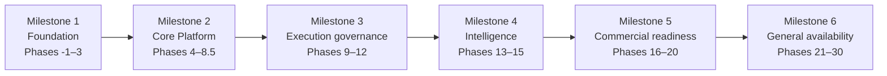

# Project Roadmap

Milestone-level sequencing of [phase tracker](phase-tracker.md) work. See
[milestones.md](milestones.md) for what each milestone delivers and
[product/roadmap.md](../../product/roadmap.md) for the original
phase-horizon framing this document sits alongside — both describe the same
phase sequence; this one is scoped to milestone-to-milestone dependencies
and gating for engineering planning, where `product/roadmap.md` stays
scoped to the product narrative.

## Sequencing rules

- A milestone does not start until every phase in the prior milestone is
  `Complete` per the [phase tracker](phase-tracker.md) — milestones do not
  overlap in status the way individual phases occasionally do during
  parallel development (e.g. Phase 1/2 overlap noted in the tracker).
- A milestone's `Definition of done` (see its detail document, where one
  exists) is the actual gate — the phase list is scope, not the finish
  line.
- Scope changes to a milestone update its detail document and this roadmap
  in the same change, per [CLAUDE.md](../../CLAUDE.md) — documentation
  drift is treated as a defect.

## Current position

Milestone 2 (Core Platform) is in progress; Phases 5–10 are `Complete`
per the phase tracker. Milestone 3 (Execution governance) is complete —
Phases 11 (Exception management) and 12 (Training and certifications)
are both `Complete` — and Milestone 4 (Intelligence) is progressing:
Phase 13 (AI ingestion and copilot) and Phase 14 (Analytics) are both
`Complete`; Phase 15 (Audit and compliance center) is starting on
`feature/phase-15-audit-compliance-center`. Phase 4 (Database and tenant
isolation) remains `In Progress` pending a live Supabase project — see
[current-project-status.md](current-project-status.md) for the live
snapshot.

## Related documents

- [Milestones](milestones.md)
- [Phase tracker](phase-tracker.md)
- [Milestone 2: Core Platform](milestone-2-core-platform.md)
- [product/roadmap.md](../../product/roadmap.md)
- [product/release-plan.md](../../product/release-plan.md)
